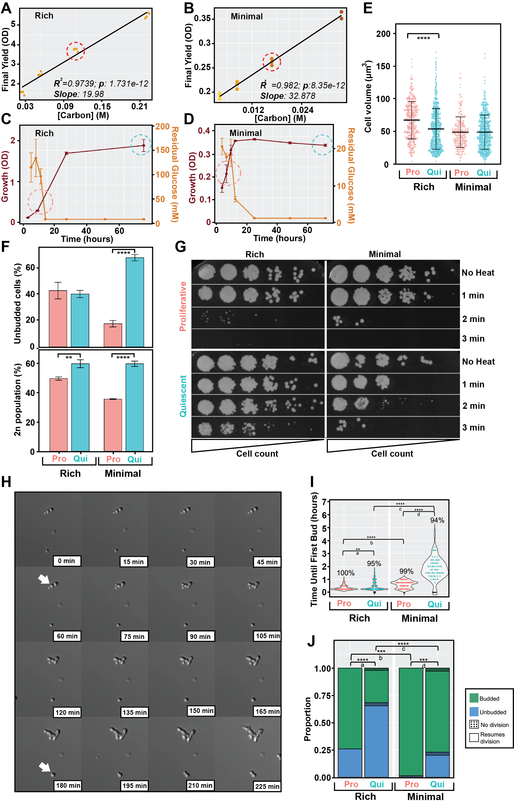

# Figure 1. Quiescence is a reversible state associated with cellular remodeling and increased stress resistance

**Status:** Partially reproducible (panels A, C, D, F from the data in this folder; B, E, H, I, J placeholders; G image only)



## Legend

The legend text below is from the resubmission legends document. **Its panel letters do not match
the current figure image** (Figure1_Ver22): the legend still uses the older Figure 1 lettering
(A = growth-phase definitions, B = minimal-media growth curves, C/D = yield vs glucose, …), and the
budding paragraph (second block, unlabelled in the legends document, with its own A–E) now
corresponds to current panels H–J. Use the Panels table for the current mapping.

**Figure 1. Quiescence is a reversible state associated with cellular remodeling and increased stress resistance.** A) Definition of microbial growth phases. B) Population growth profiles of Candida albicans quantified using absorbance (OD at 600nm) in minimal media with variable initial concentrations of glucose: 5.6 mM (n = 2), 2.8 mM (n = 3), 1.4 mM (n = 3), and 7 mM (n = 3). C) Final population yield (OD at 600nm) versus initial glucose concentration for rich media. The line indicates a linear model fit to the data. The dashed circle indicates the concentration of glucose used in rich media for all subsequent experiments. D) Final population yield (OD at 600nm) versus initial glucose concentration in minimal media. The line indicates a linear model fit to the data. The dashed circle indicates the concentration of glucose used in minimal media for all subsequent experiments. E) Quantification of cell volume for cells grown in rich and minimal media for proliferative and quiescent cells.The median value is reported in each panel and indicated by the horizontal line ± interquartile range. The p-value was determined using Student’s t-test, ∗∗∗∗p < 0.0001, ns: p > 0.05 F) Bud index quantification (top) and DNA content staining using SYTOX Green and flow cytometry(bottom). G) Cells were subjected to 1, 2, or 3 minutes of 56 °C temperature stress. 5-fold serial dilutions of cells were transferred using a pin frogger and incubated for 2 days prior to imaging. H) Percoll-based density fractionation of proliferative and quiescent cells. Denser cells migrate further through the gradient and thus appear as lower bands.

We quantified cell budding dynamics using a microcolony growth rate assay in proliferative and quiescent culture. A) Representative time-lapse microscopy images from the microcolony assay and examples of different types of budding states in starved cultures (not to scale). White arrows denote examples of bud emergence. B) Time required until first bud emergence of cells from proliferative and quiescent cultures grown in rich media and minimal media in the lab strain SC5314. We defined the time until first bud as the time required for a new bud to be detected on a cell. A score of 0 indicates that a cell did not produce a bud within the 9-hour timeframe (indicated as a black dot). The percentage of cells that resumed cell division is denoted above each violin plot. p-values for: a) 0.00191; b) 8.30E-10; c) 6.51E-22; d) 3.27E-19. C) Time required until first bud emergence of cells from proliferative and quiescent cultures grown in rich media and minimal media in the clinical isolate P34048. p-values for: a) 5.67E-19; b) 6.80E-20; c) 1.19E-08. D) Budding status and resumption of division of in lab strain SC5314. Dotted bars indicate the proportion within a specific budding status that did not produce a new bud within the 9-hour time frame. p-values for a) 7.32E-09; b) 0.000105; c) 2.83E-11; d) 0.00033. E) Budding status and resumption of division of P34048. Dotted bars indicate the proportion within a specific budding status that did not produce a new bud within the 9-hour time frame. p-values for a) 7.32E-09; b) 0.000649; c) 3.95E-19. SC5314 rich proliferative, n = 58; SC5314 rich quiescent, n = 243; SC5314 minimal proliferative, n = 75; SC5314 minimal quiescent, n = 70; P34048 rich proliferative, n = 54; P34048 rich quiescent, n = 208; P34048 minimal proliferative, n = 76; P34048 minimal quiescent, n = 74. p-values for significant differences between conditions or cultures are denoted with asterisks. For B and C, The p-values were determined using Student’s t-test; for D and E, the p-values were determined using Chi-squared test with Benjamini–Hochberg correction. ∗p < 0.05, ∗∗p < 0.01, ∗∗∗p < 0.001, ∗∗∗∗p < 0.0001).

## Panels

| Panel (current figure) | Content | Code | Input data | Status |
|---|---|---|---|---|
| A | Rich media final yield vs [Carbon] (M), linear fit (R² = 0.9739, p = 1.731e-12, slope 19.98) | `Figure_1_yield_vs_glucose.Rmd` | `Resubmission_GlucoseConcOD.xlsx` | Reproducible (fit statistics reproduced exactly) |
| B | Minimal media final yield vs [Carbon] (M), linear fit (R² = 0.982, p = 8.35e-12, slope 32.878) | – | – | Placeholder – exact fit code/data to be added |
| C | Rich media growth (OD) and residual glucose (secondary axis) over time | `Figure_1_growth_and_residual_glucose.Rmd` | `Resubmission_GrowthOD_combined.csv`, `Resubmission_GlucoseAssay_Repeat.xlsx`, `glucose_assay_sample_sheet.csv` | Reproducible (see Notes: figure values differ slightly) |
| D | Minimal media growth (OD) and residual glucose over time | `Figure_1_growth_and_residual_glucose.Rmd` | `20220808_candida_NCs_starve_growth_assay.csv`, `quiescence_nit+glu_OBI_samplesheet.csv`, `Resubmission_GlucoseAssay_Repeat.xlsx`, `glucose_assay_sample_sheet.csv` | Reproducible (see Notes: figure values differ slightly) |
| E | Cell volume, Pro vs Qui, rich/minimal | – | – | Placeholder – data to be added (no cell-volume measurements or code found) |
| F (top) | Unbudded cells (%), Pro (6 h) vs Qui (72 h), rich/minimal | `Figure_1_bud_index_and_DNA_content.Rmd` | `PC_Microscopy_analysis.csv` | Reproducible (bars/SE match; no test for the stars, see Notes) |
| F (bottom) | 2n population (%), SYTOX Green flow cytometry | `Figure_1_bud_index_and_DNA_content.Rmd` | `Ozan_CellCycle_MediaEffect3-analysis-reformat.CSV`, `Ozan_CellCycle_MediaEffect3-analysis.CSV` | Reproducible from summary tables (raw FCS not distributed; stars do not match tests, see Notes) |
| G | 56 °C heat-shock spot assay | – | – | Image only (ChemiDoc images, not distributed) |
| H | DIC microcolony time-lapse | – | – | Placeholder – data to be added (time-lapse images) |
| I | Time to first bud (violins) | – | – | Placeholder – data to be added (per-cell bud-timing table and code) |
| J | Budded/unbudded proportions and resumption of division | – | – | Placeholder – data to be added (per-cell budding status table and code) |

## How to run

From this folder:

```
Rscript -e 'rmarkdown::render("Figure_1_yield_vs_glucose.Rmd")'
Rscript -e 'rmarkdown::render("Figure_1_growth_and_residual_glucose.Rmd")'
Rscript -e 'rmarkdown::render("Figure_1_bud_index_and_DNA_content.Rmd")'
```

Outputs (PNG at 300 dpi and PDF) go to `output/`.
Required packages: rmarkdown, knitr, tidyverse, readxl, ggplot2, scales, patchwork, emmeans.

## Notes

**Provenance** (original locations under `Data_Analysis/`):

- Panel A: `Growth Curves/TF Knockout Collection Validation/glucose_conc_analysis.Rmd` and `Resubmission_GlucoseConcOD.xlsx`.
- Panels C/D: `Growth Curves/X FINISHED -- Quiescence Nutrient Starvation Growth/growth_analysis_for_paper.Rmd`, section "Figure 1B" (output `Figure1B.jpg`), plus the outlier-well removal from the same file. Rich-media OD file from `Growth Curves/TF Knockout Collection Validation/Resubmission_GrowthOD_combined.csv`.
- Panel F top: `Microscopy/Phase Contrast/Nutrient_Effect3_BF+DC/analysis/analysis2/PC_microscopy_analysis.Rmd`, chunk "Figure 1F First Submission Final Plot". Per-image Cell Counter exports are in `analysis2/data/`.
- Panel F bottom: `Cytek Flow Cytometry/X FINISHED -- Cell Cycle/MediaEffect3_DC+BF/MediaEffect3.Rmd`, chunk "Re-plotting for Figure 1F". The 2n/4n gates were set in the Cytek software (there is no gating code); the Cytek gate-statistic exports (`*_Ozan_SYTOX_Green_CellCycle_*.CSV`) and raw FCS stay in that folder.
- Panel G: raw ChemiDoc images in `Growth Curves/X FINISHED -- Quiescence Heat Shock Growth 3/56C Heatshock Quiescent/` and `.../56C Heatshock Exponential/` (`GRESHAM 2022-10-25 *.scn/.tif/.jpg`).
