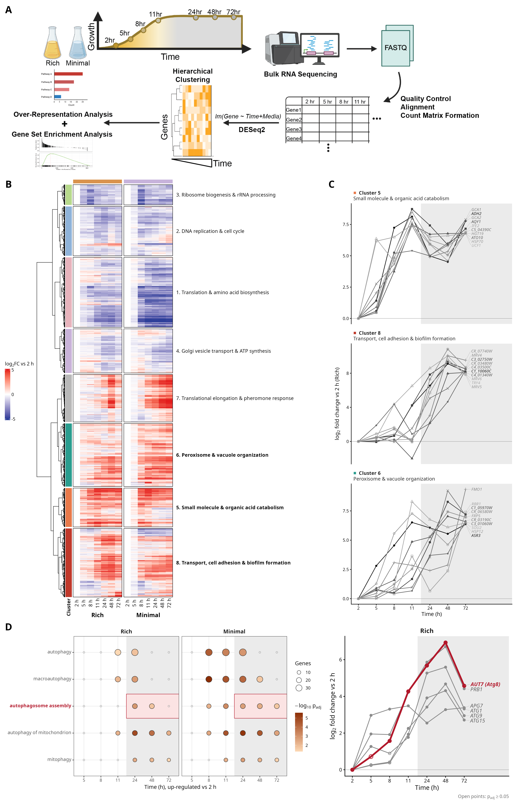

# Figure 4. Gene expression profiling in proliferative and quiescent cells (RNA-seq time course)

**Status:** Replotted (resubmission draft) – see `Figure_4_RNAseq_timecourse.Rmd`

## Legend

The resubmission legend for this figure is not final. In the original submission this was Figure 2: *Gene expression profiling in proliferative and quiescent Candida albicans cells. A) Experimental design, sequencing pipeline, and computational strategy employed to quantify transcript level changes across time. B) Hierarchical clustering defined 8 clusters that are annotated using the most significant over-represented GO terms (p < 0.05).*

## Panels

All panels are produced by one R Markdown file, `Figure_4_RNAseq_timecourse.Rmd`, which writes the
assembled figure to `output/Figure_4.{pdf,png}`.

| Panel | Content | Input data | Status |
|---|---|---|---|
| A | Experimental design and pipeline schematic | `data/Figure_4A_schematic.png` (cropped from the original-submission `Figure_4.png`) | Schematic |
| B | log2FC heatmap (each time point vs 2 h, rich and minimal, 2–72 h) of the time-responsive genes, with the dendrogram and the 8 clusters labelled by their top GO BP terms | `data/vst_batch_corrected.csv.gz`, `data/timecourse_gene_clusters.csv`, `data/DESeq2_time_vs_2h.csv.gz`, `data/ORA_GO_timecourse_clusters.csv` | Reproducible |
| C | Top 10 up-regulated genes (Rich 72 h vs 2 h) over time in the three clusters most induced at 72 h (5, 8, 6) | same as B | Reproducible |
| D | Autophagy: GO BP over-representation of autophagy terms among genes up at each time point vs 2 h (rich and minimal), and log2FC trajectories (rich medium only) of core autophagy genes with *AUT7* (Atg8) highlighted | `data/ORA_GO_contrasts_time_vs_2h.csv`, `data/DESeq2_time_vs_2h.csv.gz` | Reproducible |

`dimension_reduction_media-effect.Rmd` is the original-submission code and is kept for reference.

## Notes

- The image shown is a copy of `output/Figure_4.png`. The earlier panel D (GO over-representation of the top three clusters) was removed; the autophagy panel, formerly E, is now D.
- The data files are outputs of `CandidaTFKO5_WT_72h/analysis/WT_Rich_vs_Minimal_timecourse_DESeq2_ORA.Rmd` (`new_72h_mode = "add"`, `n_clusters = 8`, GO BP). `DESeq2_time_vs_2h.csv.gz` is the `time_vs_2h` subset of its `DESeq2_pairwise_contrasts_long.csv`. The Rmd checks that the rebuilt clustering is identical to the saved cluster assignment.
- The panel A schematic is the original-submission artwork with a 72 h point added (the 48 h point was moved to make room). The area under the growth curve and the time-point circles are recoloured to show glucose: a gold-to-pale gradient over 2–11 h (glucose falling) and grey at 24–72 h (glucose depleted). It still reads `lm(Gene ~ Time+Media)`; the current analysis uses a medium × time group model with LRTs.
- Raw reads: SRA PRJNA1271226.
