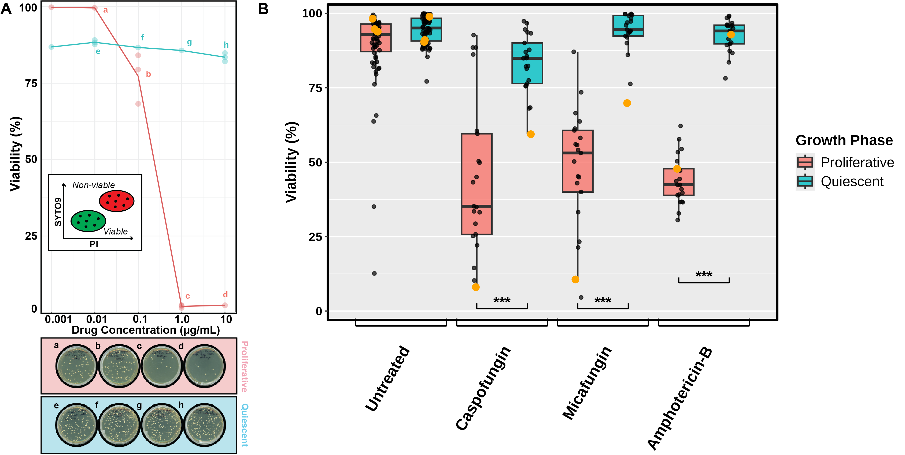

# Figure 5. Quiescent cells exhibit increased survival when treated with antifungals

**Status:** Partially reproducible (panel B reproducible from the data in this folder; panel A has no source table). Panel A is Ver8 panel A, cropped from `Figure5_Ver8.png`, with its data layer redrawn from the digitized values (see Notes). Ver8 panel B was removed. Ver8 panel C is now panel B, re-plotted from the data in this folder.

## Legend
Figure 5. Quiescent cells exhibit increased survival when treated with antifungals. A) Viability of proliferative and
quiescent cells using the lab strain SC5314 subjected to a range of doses from 0.001µg/mL to 10µg/mL of micafungin.
Viability was determined using PI/SYTO9 staining and flow cytometry. Viability estimates of samples indicated with letters
a-h were verified by plating ~200 cells onto YPD plates and counting colony forming units (CFUs). B)
Viability for proliferative and quiescent cells using 20 genetically diverse strains and the lab strain SC5314 at the LD50
drug concentration identified for proliferative SC5314 cells. Strains were treated with either 1µg/mL caspofungin, 1µg/mL
micafungin, or 20µg/mL amphotericin B. Black line inside box shows median viability of 21 strains; box range indicates
interquartile range (IQR); whiskers indicate 1.5 times the IQR from median. Viability of each strain is indicated as a black
dot; SC5314 viability is indicated with a yellow dot; the p-value was determined by Student's t-test, ∗p < 0.05, ∗∗p < 0.01,
∗∗∗p < 0.001.

## Panels
| Panel (current figure) | Content | Code | Input data | Status |
|---|---|---|---|---|
| A | SC5314 viability vs micafungin (0.001–10 µg/mL), proliferative vs quiescent; CFU plates a–h | `Figure_5_assemble.R` (Ver8 panel A; data layer redrawn) | `data/Panel_A_SC5314_micafungin_digitized.csv` (digitized, see Notes) | Not reproducible (no source table) |
| B (Ver8 C) | 20 isolates + SC5314: untreated, 1 µg/mL caspofungin, 1 µg/mL micafungin, amphotericin B; boxplots and paired t-tests | `Figure_5_assemble.R` (figure version); `Figure_5_isolate_drug_response_proliferative_vs_quiescent.Rmd` (analysis) | `data/Isolates_{AmpB,Caspofungin,Micafungin}_{Exp,Qui}.csv` | Reproducible |

## How to run
From this folder:
`Rscript -e 'rmarkdown::render("Figure_5_micafungin_clinical_isolates_dose_response.Rmd")'` and
`Rscript -e 'rmarkdown::render("Figure_5_isolate_drug_response_proliferative_vs_quiescent.Rmd")'`.
Outputs go to `output/`.
`Rscript Figure_5_assemble.R` re-plots panel B (`output/Figure_5B_isolates_drug_response.png` / `.pdf`), crops panel A
from `Figure5_Ver8.png`, and writes the assembled `output/Figure_5.png` / `.pdf` (copied to `Figure_5.png` here).
Extra packages: magick, ragg.
`Figure_5_micafungin_clinical_isolates_dose_response.Rmd` reproduces the former panel B (clinical isolates), which is no longer in the figure.
Required packages: rmarkdown, dplyr, tidyr, purrr, ggplot2.

## Notes
- **Provenance.** Inputs for the former panel B (clinical isolates) are from `Data_Analysis/Cytek Flow Cytometry/X FINISHED -- Candida_albicans_Fungicidal_Drug_Screening/Full_Screen01/data/`; the plot code is the last chunk of `Full_Screen01/Full_Screen_Analysis01.Rmd` (original output `Full_Screen01/MicaSus+Res_e+q.jpeg`). Panel B (Ver8 panel C) inputs are from `Full_Screen02/data/`; the code is the final "4 pairs" chunk of `Full_Screen02/Full_Screen02_Analysis_Highlighted.Rmd` (original output `Full_Screen02/drug_response_4pairs.png`). All CSVs are gated Live/Dead percentages per well; raw FCS files are not distributed.
- **Viability scale.** Both Rmds plot viability as a fraction, Live/(Live+Dead) (0–1), as in the source scripts. The figure shows the same values as % (0–100); axis styling, labels (Proliferative/Quiescent) and significance brackets were added in the figure layout.
- **Former panel B strain identities (no longer in the figure).** The source data use screen IDs. p37005 = `Sample1` and p57055 = `Sample17`. This mapping is inferred from the source plot code (`Sample1` solid, `Sample17` dashed) and from matching the plotted values to the figure. It is not recorded in the data files. The source script used an undefined object `combined_data_clean`; the Rmd rebuilds it from the four micafungin CSVs with Live/(Live+Dead). The output matches `MicaSus+Res_e+q.jpeg` and panel 5B (for example, proliferative p37005 at 1 / 10 µg/mL = 0.558 / 0.140; p57055 = 0.735 / 0.646). The original plot title "Sample: SC5314 and Sample11" was wrong and is not used.
- **Panel B statistics.** These paired t-test p-values (Exp vs Qui, paired by strain, n = 21) match the source notebook exactly: amphotericin B 7.42e-16, caspofungin 5.03e-07, micafungin 4.49e-11.
- **Panel A.** No source table or script reproduces the Ver8 panel A values. Related material:
  `Full_Screen01/data/Lab_Strains_{Exponential,Quiescent}.CSV`; older plot code only in `Full_Screen01/.Rhistory` (around lines 186–256); CFU plates and counts in `Data_Analysis/CFU Quantification/Fungicidal Drug Screening/` (`Casp_Mica_CFU_count.csv`, plate photos).
- **Layout (2026-10-04).** Panel A is Ver8 panel A, unchanged (an earlier re-plot with black error bars was reverted). Ver8 panel B (clinical isolates p57055 / p37005) was removed, and Ver8 panel C was moved to its place on the right and relabelled B. Panel B is re-plotted by `Figure_5_assemble.R` at the full height of panel A (1700 px at 300 dpi), so it does not leave white space under it. The re-plot uses the same data and paired t-tests as the Rmd, and copies the Ver8 styling that was added in the figure layout: % scale, drug brackets, significance bars at the Ver8 positions, and Proliferative/Quiescent labels. Point jitter is random (seed 1), so individual dots sit slightly differently from Ver8. The "A" and "B" tags are the Ver8 letters.
- **Panel A values (digitized).** Panel A was a raster image inside `Figure5_Ver8.ai`. Values were read from it using its 0/25/50/75/100 gridlines as the scale, which gives about 0.05 % per pixel. At 0.1 µg/mL (proliferative), the three replicates (84.03, 79.37, 68.20) and the error bar (72.4–82.0) show the original bars are mean ± SEM (SEM 4.70), not SD (8.1). At most other doses all replicates were hidden under the mean point, so their SEM is < ~0.6 % and is left blank (no error bar drawn). Where two replicates were visible, the third was computed from the mean. These are recovered plot values, not the raw data, and should be replaced with the source table if it is found. They are kept in `data/Panel_A_SC5314_micafungin_digitized.csv`.
- **Panel A data layer (2026-10-05).** The large mean dots and the SEM bar of Ver8 were removed. `Figure_5_assemble.R` clears the Ver8 plot interior (gridlines rebuilt from the Ver8 gridline profile; inset, axes, frame and CFU plates kept as Ver8 pixels) and redraws: a thin line through the group means, the replicate values as faint points, and the plate letters a–h at their Ver8 positions. Replicates are drawn where they could be digitized (0.1 and 1 µg/mL proliferative; 0.01 and 10 µg/mL quiescent). At the other doses the replicates were hidden under the Ver8 mean dot, so only the mean is known and it is drawn as one faint point.
- **Known data and legend issues (reported, not fixed):**
  - `Isolates_Caspofungin_Exp.csv`: Samples 7–10 have wells with the wrong labels. The Dose 0 (untreated) rows are treated wells: Sample7 B1 0.001ug, Sample8 F3 10ug, Sample9 C5 0.01ug and Sample10 D7 0.1ug. The Dose 1 rows for Sample8 (B3 0.001ug), Sample9 (F5 10ug) and Sample10 (A7 Blank) are also not 1 µg/mL wells, going by their `Name`.
  - `Isolates_AmpB_Qui.csv`: the SC5314 control well (QuiCTL, A09) is coded Dose 1 and the treated well (QuiTRT, A10) Dose 0, so the two are swapped. The AmpB files do not record the dose in µg/mL; the legend states 20 µg/mL.
  - "Untreated" pools the Dose 0 wells from all three drug files, so each strain has three values per growth phase. As a result, `pivot_wider()` makes list-columns and the Untreated paired test returns NA (n_pairs is still reported as 21). The Untreated boxes show 63 points each.
  - The legend says "Student's t-test", but the code runs a paired t-test. The legend says SC5314 is a yellow dot; the code draws it orange.
- **Code changes from the source.** The broken v1 plot chunk (duplicated factor levels) and the unused v2 test chunk were dropped. Files are read with `fileEncoding = "UTF-8-BOM"` because most CSVs start with a byte-order mark; without it, `rbind()` fails in non-UTF-8 locales. `cur_data_all()` (deprecated) was replaced by `pick(everything())`, which gives the same result here.
