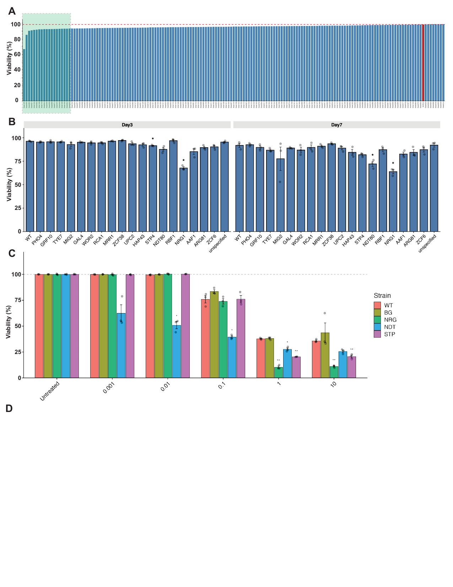

# Figure 6. Transcriptional regulation of quiescence

**Status:** Partially reproducible

## Legend
Figure 6. Transcriptional regulation of quiescence. A) Screen of TF KOs for decreased survival in
quiescence. B) Gene expression analysis of TF KOs.

The legend does not match the current figure draft (`Figure6_Ver1.ai`), which has four panels:
A, the ranked viability screen; B, Day 3/Day 7 validation of 19 selected KOs; C, micafungin
viability of WT/BG/NRG/NDT/STP (proliferative cells, normalized to untreated); D, empty. The legend describes only two panels. Its "A" covers
draft panels A-B, and its "B" (gene expression) is not yet in the draft. The TF KO RNA-seq volcano
plot is the candidate for draft panel D.

**Draft panels A and B have moved to the supplement.** The screen (A) is now
[Supplementary Figure 23](../Supplementary_Figure_23/), and the Day 3 / Day 7 validation (B) is now
[Supplementary Figure 24](../Supplementary_Figure_24/). The per-strain screen table that was missing here was regenerated
from the FCS files. It is in `Supplementary_Figure_23/data/OzanImir_20260310_v1_viability_results.csv`.

## Panels
| Panel (current figure) | Content | Code | Input data | Status |
|---|---|---|---|---|
| A | Ranked viability of the TF KO collection after 3 days of quiescence (166 KOs + SC5314 in red) | `Figure_6_TFKO_viability_screen.Rmd` | `data/flow_screen/` | Summary table to be added: the per-strain table `OzanImir_20260310_v1_viability_results.csv` is not on disk. The plot chunk runs once that file is added. The strain-to-gene plate map is also to be added. |
| B | Day 3 / Day 7 viability of 19 selected KOs + WT; Welch t-test vs WT per day, BH | `Figure_6_TFKO_viability_validation.Rmd` | `data/flow_validation/` | Reproducible: summary, p-values and stars match the saved results exactly |
| C | Proliferative cells: viability of WT, BG, NRG, NDT, STP across micafungin doses (Untreated, 0.001-10 µg/mL), normalized to each strain's untreated mean; paired t-test on raw viability vs WT per dose, Holm | `Figure_6_TFKO_micafungin_proliferative.Rmd` | `data/flow_micafungin_proliferative/` | Reproducible from the current data: matches the saved stats CSV and saved PNG exactly. **The draft image shows an older gating with different bars and stars** (see Notes). |
| (not in draft) | Quiescent counterpart: raw viability of the same strains across micafungin doses, with stats | `Figure_6_TFKO_micafungin_quiescent.Rmd` | `data/flow_micafungin_quiescent/` | Quiescent counterpart, not in the current draft. The saved stats do not reproduce from the saved per-sample table (see Notes). |
| D | (candidate) Volcano plots of 72 h vs 6 h gene expression for each TF KO (BG, NDT, NRG, STP) | `Figure_6_TFKO_RNAseq.Rmd` | `data/CandidaTFKO5_NovaSeq_24_gene_count_matrix_rounded.tsv`, `data/C_albicans_A22_r228_gene_info.tsv`, `data/cgd_C_albicans_SC5314.gaf.gz`, `data/pathwaysAndGenes.tab` | Reproducible. The panel is empty in the draft. |

## How to run
From this folder, for each Rmd: `Rscript -e 'rmarkdown::render("<file>.Rmd")'`. Outputs go to `output/`.

Required packages:
- Flow analyses (A-C): tidyverse, cowplot, scales.
- RNA-seq (D): DESeq2, clusterProfiler (>= 4.20), data.table, ggplot2. It needs R >= 4.6.

All four Rmds were rendered with R 4.6.1. The flow gating sections (CytoExploreR, flowWorkspace)
are `eval = FALSE` because the raw FCS files are not distributed.

## Notes
- **Flow cytometry (A-C).** All three experiments used SYTO9/PI staining on a Cytek cytometer and
  were gated with CytoExploreR: Cells (FSC-A/SSC-A) > Single_cells (SSC-A/SSC-H) > Live_cells and
  Dead_cells (PI YG4-A vs SYTO9). Transforms were arcsinh with cofactor 150 for the fluorescence
  channels and 500 for FSC/SSC. Viability = Live / (Live + Dead). SYTO9 was read on B7-A in the
  screen and both micafungin experiments, and on B3-A in the validation experiment (the gating
  template and markers file agree). The raw FCS files are not distributed. Each `data/flow_*/`
  folder has the sample sheet, CytoExploreR experiment details, the markers file, the gating
  template and the gated per-sample summaries where they exist.
- **Panel A provenance:** `Data_Analysis/Cytek Flow Cytometry/Knockout_Quiescence_Viability_2/KO_Strain_Viability.Rmd`
  (version `OzanImir_20260310_v1`). The original plot (`OzanImir_20260310_v1_viability_plot.{pdf,png}`,
  167 bars, SC5314 = 98.7%) is in that folder. The per-strain table it was drawn from is not saved,
  and `KO_Strain_Viability.nb.html` has no chunk outputs, so the table cannot be recovered.
  Strain IDs (Strain001-Strain166) are plate positions. The strain-to-gene plate map is to be added.
- **Panel B provenance:** `Data_Analysis/Cytek Flow Cytometry/Knockout_Quiescence_Viability_3_Validation/KO_Strain_Viability.Rmd`
  (version `OzanImir_20260401_v1`). The Rmd here starts from the saved
  `viability_by_replicate_OzanImir_20260401_v1.csv`. It reproduces
  `viability_summary_...csv` and `viability_vs_WT_significance_...csv` to machine precision, and it
  reproduces the barplot `viability_barplot_with_significance_...pdf`. Significant results
  (BH-adjusted p < 0.05) are STP4 and NRG1 at Day 3, and NDT80 and NRG1 at Day 7. The KO labelled
  "unspecified" in the sample sheet is orf19.3253.
- **Panel C provenance:** `Data_Analysis/Cytek Flow Cytometry/Knockout_Quiescence_Viability_4_ValidationExtended/Proliferative/KO_Strain_Viability.Rmd`
  (version `OzanImir_20260809_v1`, Plot 2 with stats, `viability_normalized_to_untreated_with_stats_OzanImir_20260809_v1`).
  Strains: WT = SC5314; BG = parental background strain of the KO collection; NRG = NRG1 KO
  (orf19.7150); NDT = NDT80 KO (orf19.2119); STP = STP4 KO (orf19.909).
  - *Untreated controls.* Only 6HC-group untreated samples are used, except for NRG1. Its 6HC
    untreated samples were removed, so all its untreated samples (DR group) are used. This rule is
    kept as in the source.
  - *Inputs.* The Rmd runs from the saved per-sample table
    `viability_normalized_to_untreated_OzanImir_20260809_v1.csv`: 90 rich-media samples, after
    the untreated selection. The WT minimal-media samples are not in that table and are not used.
  - *Left out.* The leave-one-out plots, the WT dose-response plot and the proliferative-vs-quiescent
    WT line plot (`Exponential_DrugDose_plot`) are not in the draft.
  - *Verification.* Recomputed p-values, adjusted p-values and stars match
    `strain_vs_WT_paired_ttest_OzanImir_20260809_v1.csv` (max difference 1e-16). The plot matches
    the saved `viability_normalized_to_untreated_with_stats_OzanImir_20260809_v1.png`. Stars:
    NDT ** at 0.01, NDT * at 0.1, BG * and NDT * at 1. WT normalized viability is about 2% at
    1-10 µg/mL.
  - *The draft panel C is an older version.* It matches the older saved
    `viability_normalized_to_untreated_with_stats_OzanImir_20260809_v1.pdf`, not the current PNG.
    In that version, WT, BG and STP are at about 36-44% at 1-10 µg/mL; in the current data they
    are about 2-4% (BG at 10 is about 24%).
    Its stars (NDT * at 0.01 and 0.1; NRG ** and STP ** at 1 and 10; NDT * at 1) match neither the
    saved stats CSV nor the current PNG. The source Rmd notes that the Live_cells gate was redrawn
    because micafungin-killed proliferative cells fell inside it. The draft panel therefore
    appears to predate that regating and should be replaced.
- **Quiescent counterpart (not in the current draft):** `Data_Analysis/Cytek Flow Cytometry/Knockout_Quiescence_Viability_4_ValidationExtended/Quiescent/KO_Strain_Viability_Quiescent.Rmd`
  (version `OzanImir_20260809_v1`, Plot 2 raw viability with stats). This folder has it as
  `Figure_6_TFKO_micafungin_quiescent.Rmd`. All 90 quiescent samples are rich media.
  - *The saved stats do not reproduce from the saved per-sample table.* Recomputing from
    `viability_raw_by_strain_OzanImir_20260809_v1.csv` gives p-values that differ from
    `strain_vs_WT_paired_ttest_OzanImir_20260809_v1.csv` by up to 0.016, and 5 of 20 star labels
    change (one, NRG at 1 µg/mL, becomes not significant). The per-sample counts in the saved CSV
    differ from those in the notebook run that produced the stats. For example, NRG untreated rep 1
    is 17991/1418 live/dead in the CSV and 18458/1231 in the notebook. The `.nb.html` does not
    contain the full count table.
- **Panel D (RNA-seq):** `Figure_6_TFKO_RNAseq.Rmd`. For each TF KO (BG, NDT, NRG, STP), DESeq2
  compares 72 h with 6 h (`~ time`, Wald test, padj < 0.05), using triplicates. Enrichment uses CGD
  GO annotations and CGD pathways, by ORA of up/down genes and by seeded GSEA on the Wald
  statistic. Raw reads are in SRA (PRJNA1271226).
- Figure image: page 1 of `Figure_Design/Paper1/Figure6/Figure6_Ver1.ai`, rendered at 150 dpi.
