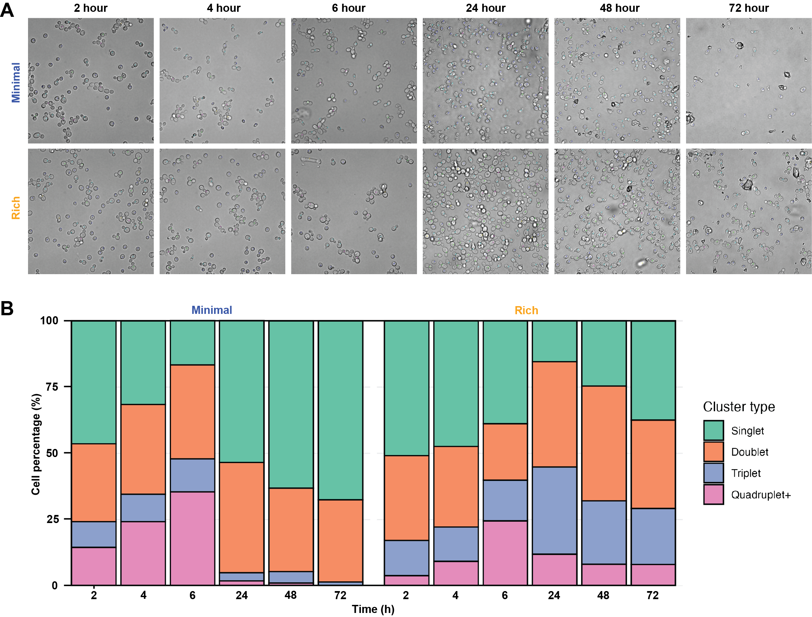

# Supplementary Figure 1. Phase contrast microscopy images of rich and minimal media-grown proliferative and quiescent cells used for bud index quantification

**Status:** Partially reproducible (panel B from the data in this folder; panel A image only)

## Legend

**Supplementary Figure 1. Phase contrast microscopy images of rich and minimal media-grown proliferative and quiescent cells used for bud index quantification.** A) Representative phase contrast microscopy images showing cells at different growth phases grown in rich and minimal media. Cells are counted and marked as 1 (singlet), 2 (doublet), 3 (triplet), 4 (quadruplet+) or 5 (ambiguous) and counted using Cell Counter plugin for ImageJ. B) Cell cluster type percentages change with time in cells grown in rich and minimal media. Counts quantified from Cell Counter outputs; minimum of 200 cells were counted per condition.

## Panels

| Panel (current figure) | Content | Code | Input data | Status |
|---|---|---|---|---|
| A | Representative phase contrast images, minimal and rich, 2–72 h | – | – | Image only (microscopy images not distributed) |
| B | Stacked bars of singlet/doublet/triplet/quadruplet+ percentages per Media × Time | `Supplementary_Figure_01_cell_cluster_composition.Rmd` | `PC_Microscopy_analysis.csv` | Reproducible (percentages match the figure) |

## How to run

From this folder: `Rscript -e 'rmarkdown::render("Supplementary_Figure_01_cell_cluster_composition.Rmd")'`. Outputs go to `output/`.
Required packages: rmarkdown, knitr, tidyverse.

## Notes

- Source: `Data_Analysis/Microscopy/Phase Contrast/Nutrient_Effect3_BF+DC/analysis/analysis2/PC_microscopy_analysis.Rmd`, chunk "Supplementary Figure 1 Re-plot". Panel A images are in the same folder: `Rich-*h.jpg`, `Minimal-*h.jpg` and `Minimal-24h.tif`. The per-image Cell Counter exports and marker overlays are in `analysis2/data/`.
- Ambiguous cells are counted, but the panel B percentages exclude them.
- With ambiguous cells excluded, rich 6 h has 196 counted cells, below the "minimum of 200 cells" in the legend; 205 including ambiguous.
- `PC_Microscopy_analysis.csv` contains two rows named `Minimal-72h005_A2`. The second (11, 7, 1, 0, 0) is identical to the `Minimal-72h005_A3` row, and `Minimal-72h002_C3` has a marker image but no count row. This is possibly a duplicated or mislabelled entry. It affects the minimal 72 h bar (reported, not changed).
