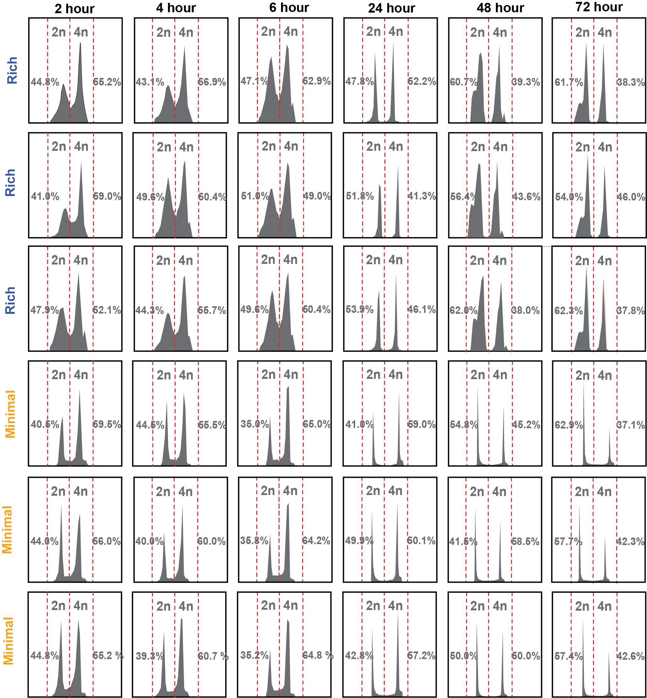

# Supplementary Figure 2. DNA content analysis of proliferative and quiescent cultures in rich and minimal media

**Status:** Image only – raw FCS not distributed

## Legend

**Supplementary Figure 2.** DNA content analysis of proliferative and quiescent cultures in rich and minimal media. Distribution of 2n and 4n DNA peaks. N = 50,000 events for each panel.

## Panels

| Panel | Content | Code | Input data | Status |
|---|---|---|---|---|
| – | SYTOX Green DNA-content histograms (2n/4n) | – | – | Image only |

## Notes

Histograms were exported from Cytek SpectroFlo. The gated 2n percentages used in Figure 1 are in `Figure_1/`.
