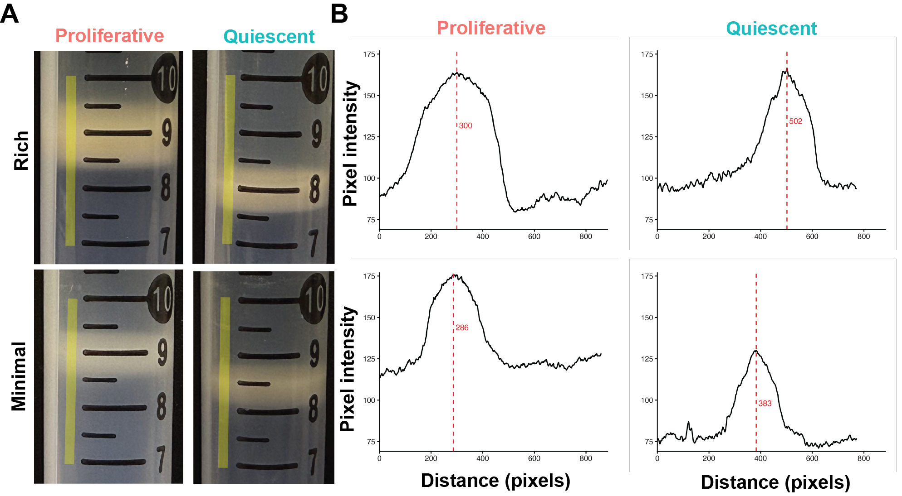

# Supplementary Figure 3. Density fractionation of proliferative and quiescent cultures in rich and minimal media

**Status:** Partially reproducible (panel B from the data in this folder; panel A image only)

## Legend

**Supplementary Figure 3. Density fractionation of proliferative and quiescent cultures in rich and minimal media.** A) Images of density fractionation indicating the region assessed for pixel quantification(yellow vertical line). B) Pixel intensity distribution across the analyzed region with maximum distance at which peak pixel intensity was achieved is indicated (red line with red text).

## Panels

| Panel (current figure) | Content | Code | Input data | Status |
|---|---|---|---|---|
| A | Percoll gradient tube photos (rich/minimal × proliferative/quiescent) with the profiled region | – | – | Image only (photos not distributed) |
| B | Pixel intensity line profiles with the peak position marked | `Supplementary_Figure_03_percoll_pixel_intensity.Rmd` | `Rich_Exp_values.csv`, `Rich_Qui_values.csv`, `Minimal_Exp_values.csv`, `Minimal_Qui_values.csv` | Reproducible (peak positions 300, 502, 286, 383 px reproduced) |

## How to run

From this folder: `Rscript -e 'rmarkdown::render("Supplementary_Figure_03_percoll_pixel_intensity.Rmd")'`. Outputs go to `output/`.
Required packages: rmarkdown, knitr, tidyverse, cowplot.

## Notes

- Source: `Data_Analysis/Percoll Fractionation/MediaEffect/pixel_intensity_plotter.r`, ported to Rmd. The profiles are ImageJ line-profile exports. Panel A photos are in the same folder (`Rich_Exp_pic.png`, `Rich_Qui_pic.png`, `Minimal_Exp_pic.png`, `Minimal_Qui_pic.png`).
- "Exp" = proliferative and "Qui" = quiescent.
- The axis titles ("Pixel intensity", "Distance (pixels)") and column/row labels were added in Illustrator. The script draws the panels without axis titles.
