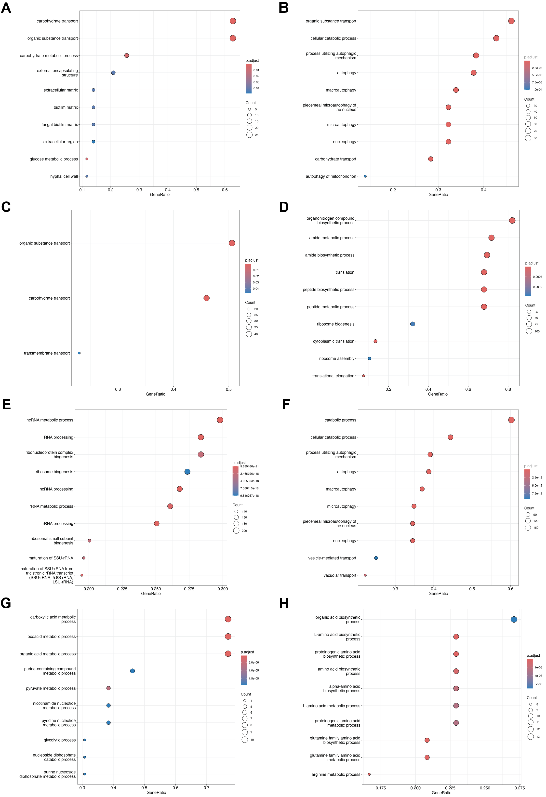

# Supplementary Figure 8. Overrepresentation analysis of differentially expressed gene clusters

**Status:** Being replotted together with Figure 4 – code below is the original-submission version and has not been updated

## Legend

**Supplementary Figure 8.** Overrepresentation analysis of differentially expressed gene clusters defined in Figure 2. Dotplot showing over–represented GO term descriptions for genes in A) cluster 1, B) cluster 2, C) cluster 3, D) cluster 4, E) cluster 5, F) cluster 6, G) cluster 7, and H) cluster 8.

## Panels

| Panel | Content | Code | Input data | Status |
|---|---|---|---|---|
| A–H | GO over-representation dotplots for clusters 1–8 | `geneset_analysis_figure2.Rmd` | UniProt table, CGD GAF, cluster gene lists (not yet in this folder) | Being replotted |

## Notes

- Depends on the cluster gene lists from Figure 4, which is being replotted.
- The Rmd builds the custom `org.Calbicans.eg.db` OrgDb with AnnotationForge.
