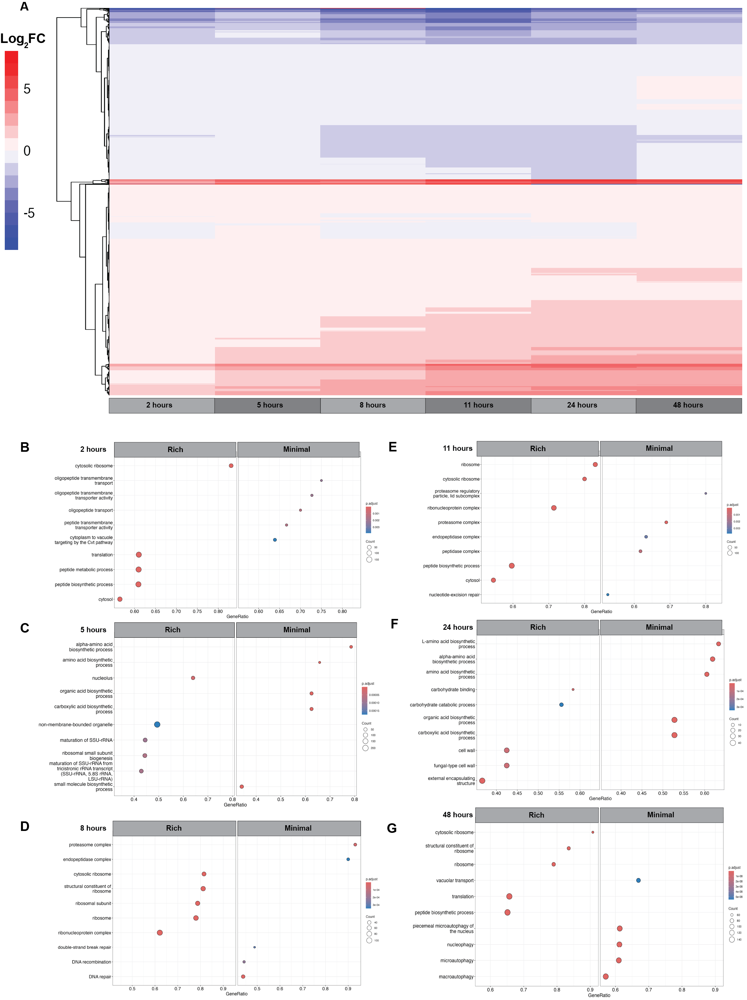

# Supplementary Figure 9. Differential gene expression analysis of media conditions

**Status:** Being overhauled – no code in this folder yet

## Legend

**Supplementary Figure 9.** Differential gene expression analysis of media conditions . A) Heatmap of the relative log2-transformed fold changes of gene expression in rich media compared to minimal media at each time point. The data were clustered using hierarchical clustering. Gene Set Enrichment Analysis (GSEA) was used to find enriched GO terms at B) 2 hours post-inoculation, C) 5 hours post-inoculation, D) 8 hours post-inoculation, E) 11 hours post-inoculation, F) 24 hours post-inoculation, and G) 48 hours post-inoculation. Only significant GO terms (adjusted p-value < 0.05 ) are shown.

## Panels

| Panel | Content | Code | Input data | Status |
|---|---|---|---|---|
| A | Rich vs minimal log2FC heatmap per time point | – | – | Being overhauled |
| B–G | GSEA of rich vs minimal at 2–48 h | – | – | Being overhauled |

## Notes

This figure is being overhauled; the image shown is the original-submission version.
