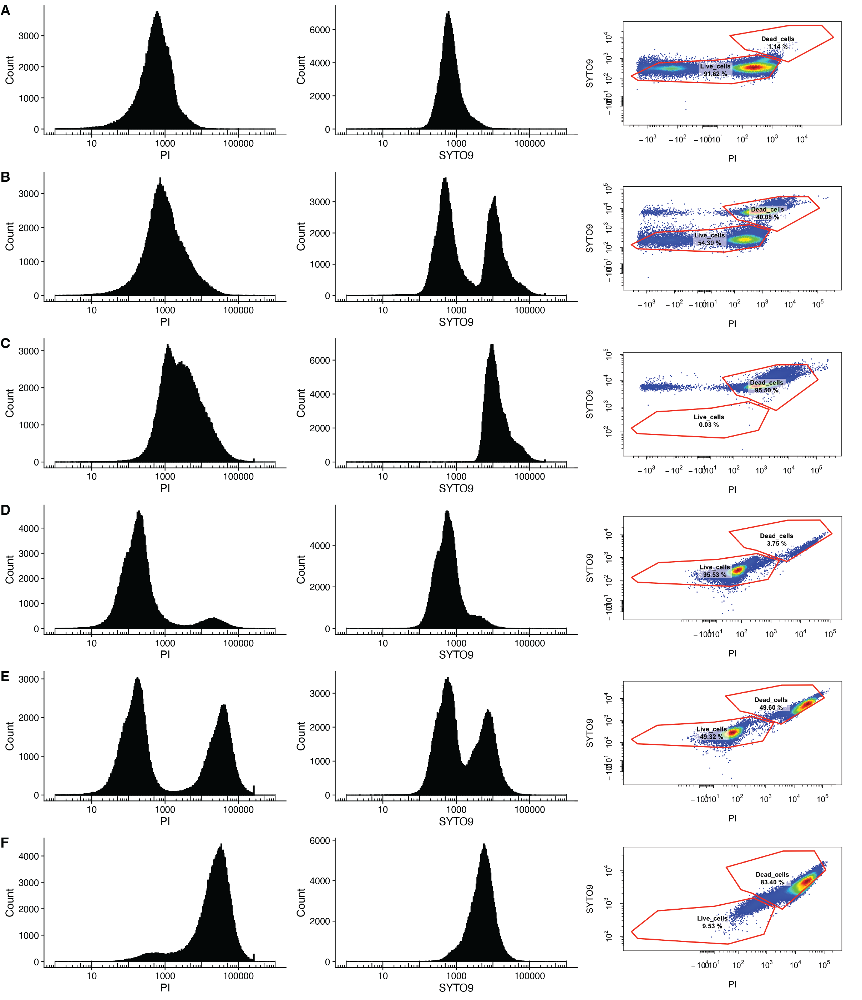

# Supplementary Figure 15. Validation of PI/SYTO9 staining and flow cytometry to measure viability of proliferative and quiescent cells

**Status:** Image only (raw FCS not distributed); gating documented. The expected-vs-measured viability summary runs from values typed into the Rmd.

## Legend
Supplementary Figure 15. Validation of PI/SYTO9 staining and flow cytometry to measure viability of proliferative
and quiescent cells. In each panel the distribution of PI (left panel), SYTO9 (middle panel) and the scatter plot of PI
versus SYTO9 used to define flow cytometry gates is displayed for A) untreated proliferative cells grown (100% viability
expected), B) a 50:50 mixture of untreated cells and cells exposed to 68℃ for 1 hour (50% viability expected) C) cells
exposed to 68℃ for 1 hour (100% inviability expected) D) untreated quiescent cells (100% viability expected), E) a 50:50
mixture of untreated quiescent cells and quiescent cells exposed to 68℃ for 1 hour (50% viability expected), and F)
quiescent cells exposed to 68℃ for 1 hour (100% inviability expected). For the experiment, all cells were grown in rich
media.

## Panels
| Panel (current figure) | Content | Code | Input data | Status |
|---|---|---|---|---|
| A–F, left/middle | PI and SYTO9 histograms per sample (A–C proliferative 100/50/0 % alive; D–F quiescent) | `Supplementary_Figure_15_heat_killing_viability_controls.Rmd` (gating section, `eval = FALSE`) | FCS (not distributed); `data/Vignette-Experiment-Details.csv`, `data/Vignette-Experiment-Markers.csv`, `data/cytek_gating_OzanImir_20250918_v2.csv` | Image only (raw FCS not distributed); gating documented |
| A–F, right | Gated PI × SYTO9 scatter with Live_cells / Dead_cells % | same (gating section) | same | Image only (raw FCS not distributed); gating documented |
| (not in current image) | Expected vs measured % live / % dead | same ("Expected vs measured viability") | values typed into the Rmd | Reproducible |

## How to run
From this folder: `Rscript -e 'rmarkdown::render("Supplementary_Figure_15_heat_killing_viability_controls.Rmd")'`. Outputs go to `output/`.
Required packages: rmarkdown, dplyr, tibble, ggplot2. The gating section needs CytoExploreR, flowCore, flowWorkspace, openCyto and cowplot, plus the FCS files in `FCS_files/`. It is not evaluated.

## Notes
- **Provenance.** The gating code comes from `Data_Analysis/Cytek Flow Cytometry/X FINISHED -- Candida_albicans_Fungicidal_Drug_Screening/Supplementary Figure Reanalysis/HeatKilling_FCS_Analysis/HeatKilling_FCS_Analysis.Rmd`, which was based on Julie Chuong's CytoExploreR vignette. The six FCS files (`Ozan_Exp+Qui_SuppFigure16-*.fcs`, about 44 MB each) and the original plots (`plots/PI_SYTO9_grid_2x6_p01.pdf`, `plots/PI_SYTO9_gating_*.png`) stay in that folder. The quantification code comes from `X FINISHED -- PI_Heatshock/Quantification/HeatKilling_Quantification.R`, and its rendered PNGs match.
- **Panel order.** The panel order follows `Vignette-Experiment-Details.csv` (Exponential 100, 50, 0, then Quiescent 100, 50, 0). The original histogram PDF has the same order.
- **Gating templates.** The source used `version_name = "OzanImir_20250918_v2"`, but `cytek_gating_OzanImir_20250918_v2.csv` contains only the Live_cells and Dead_cells gates (parent `Single_cells`). The Cells and Single_cells parent gates appear only in `cytek_gating_OzanImir_20250918_v1.csv`, which is shipped for reference. Applying v2 alone to a fresh gating set would fail, and the history does not show how the parent gates were created for v2. In the source, the gates were drawn interactively with `cyto_gate_draw()`; the Rmd documents `cyto_gatingTemplate_apply()` instead.
- **Typed-in values do not match the figure.** The measured % live values in the quantification script (proliferative 95.40 / 44.44 / 3.91, quiescent 97.76 / 50.47 / 1.70 for 100 / 50 / 0 % alive) differ from the Live_cells % printed in the figure scatter panels (A 91.62, B 54.30, C 0.03, D 95.53, E 49.32, F 9.53). They probably come from an earlier gating or experiment (PI_Heatshock). That plot is not part of the current figure image.
- **Fill colour.** The histograms in the figure are black; the code uses `fill = "steelblue"` with `alpha = 0.6`. This is presumably a layout change.
- **Not shipped.** `exp-details-backup.csv` in the source folder is the drug-screen details file, not this experiment's, so it is not shipped.
