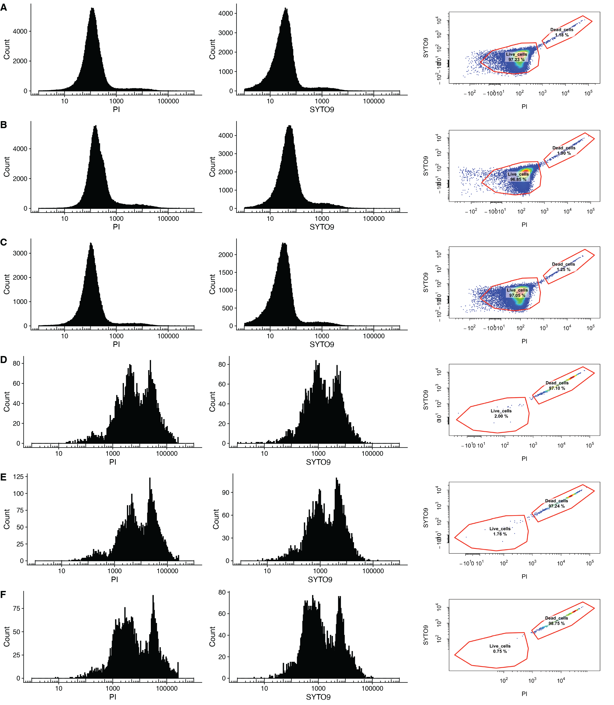
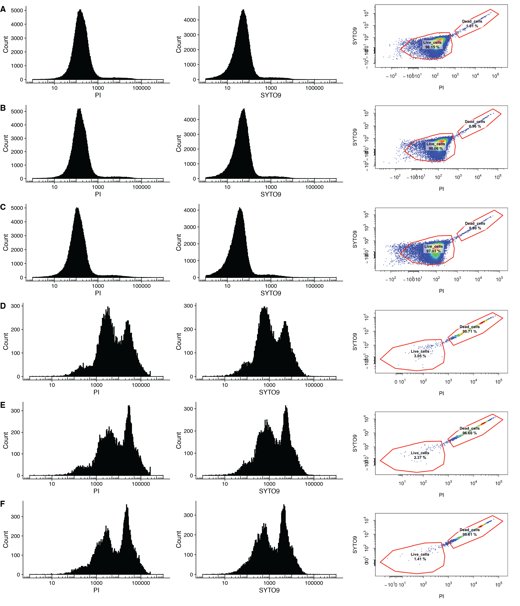
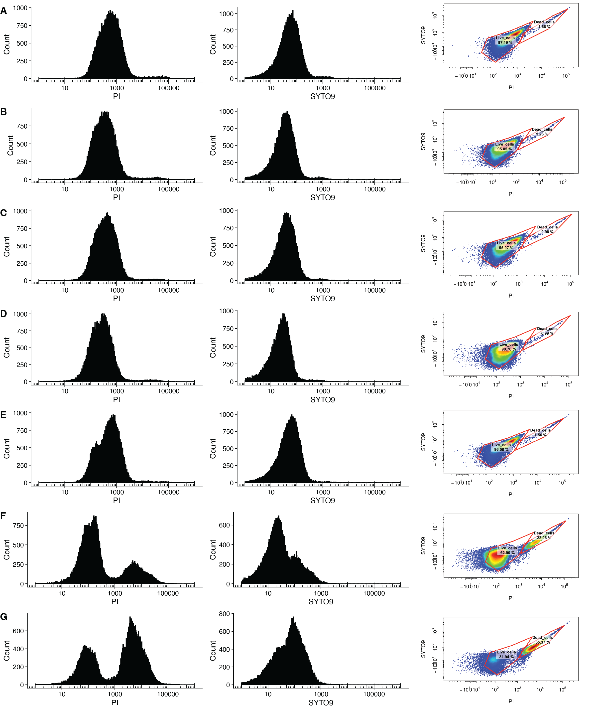
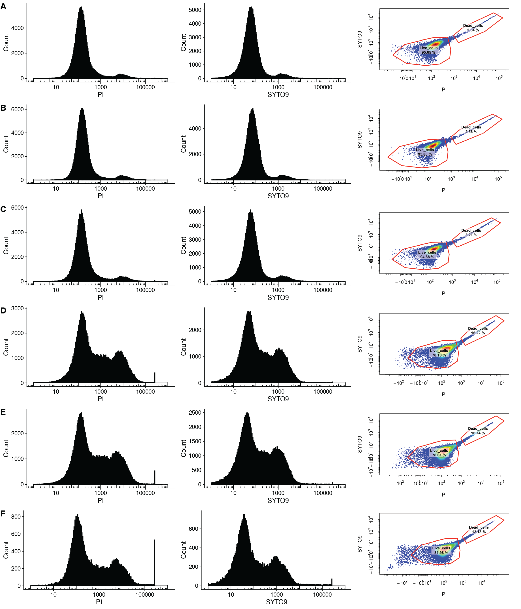
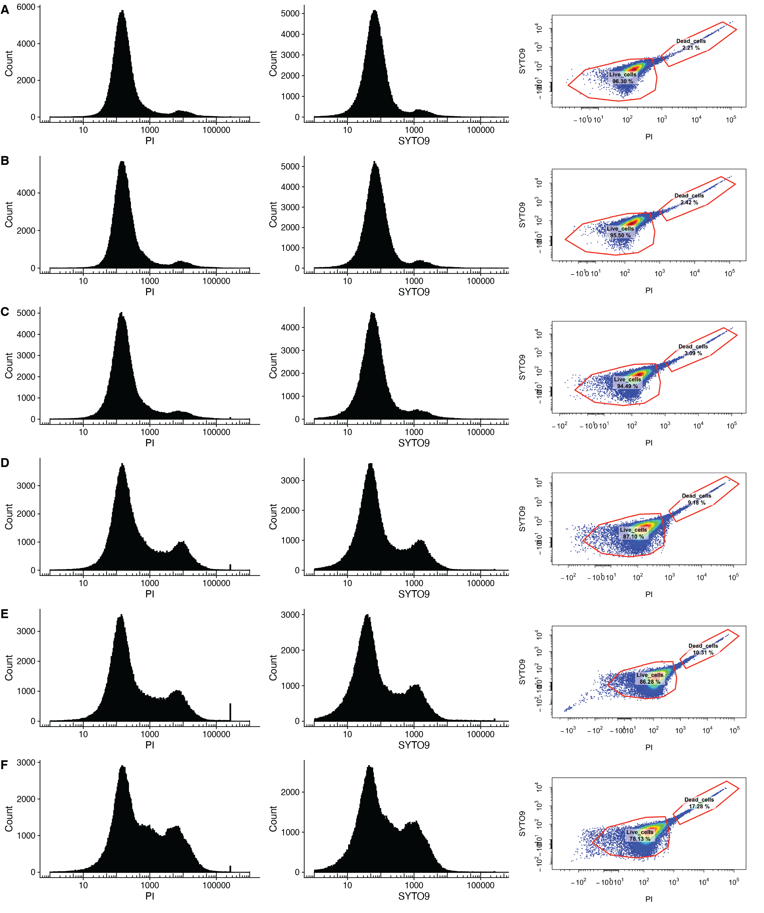
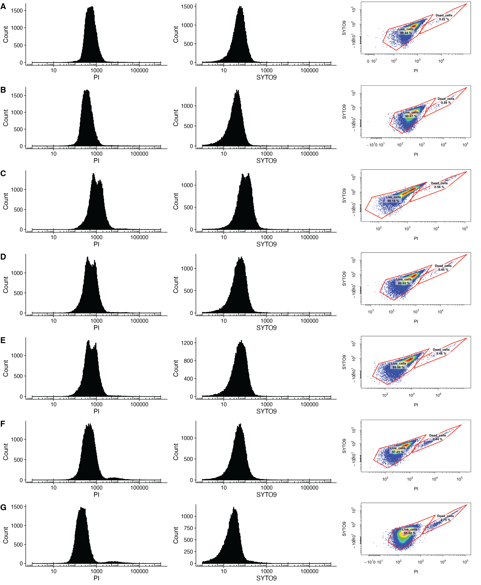

# Supplementary Figures 15–20. Cell viability quantification to validate accuracy of PI/SYTO9 staining quantification with antifungal-exposed proliferative and quiescent cells

**Status:** Image only (raw FCS not distributed); gating documented

## Legend
Supplementary Figure 15. Cell viability quantification to validate accuracy of PI/SYTO9 staining quantification
with caspofungin exposed proliferative cells. A) PI and SYTO9 distribution functions as well as the gated PI/SYTO9
2D quantification of untreated proliferative cells grown in rich media. B) PI and SYTO9 distribution functions as well as the
gated PI/SYTO9 2D quantification of proliferative cells exposed to 0.001ug/mL caspofungin grown in rich media. C) PI and
SYTO9 distribution functions as well as the gated PI/SYTO9 2D quantification of cells exposed to 0.01ug/mL caspofungin
grown in rich media. D) PI and SYTO9 distribution functions as well as the gated PI/SYTO9 2D quantification of cells
exposed to 0.1ug/mL caspofungin grown in rich media. E) PI and SYTO9 distribution functions as well as the gated
PI/SYTO9 2D quantification of cells exposed to 1ug/mL caspofungin grown in rich media. F) PI and SYTO9 distribution
functions as well as the gated PI/SYTO9 2D quantification of cells exposed to 10ug/mL caspofungin grown in rich media.

Supplementary Figure 16. Cell viability quantification to validate accuracy of PI/SYTO9 staining quantification
with micafungin exposed proliferative cells. A) PI and SYTO9 distribution functions as well as the gated PI/SYTO9 2D
quantification of untreated proliferative cells grown in rich media. B) PI and SYTO9 distribution functions as well as the
gated PI/SYTO9 2D quantification of proliferative cells exposed to 0.001ug/mL micafungin grown in rich media. C) PI and
SYTO9 distribution functions as well as the gated PI/SYTO9 2D quantification of cells exposed to 0.01ug/mL micafungin
grown in rich media. D) PI and SYTO9 distribution functions as well as the gated PI/SYTO9 2D quantification of cells
exposed to 0.1ug/mL micafungin grown in rich media. E) PI and SYTO9 distribution functions as well as the gated
PI/SYTO9 2D quantification of cells exposed to 1ug/mL micafungin grown in rich media. F) PI and SYTO9 distribution
functions as well as the gated PI/SYTO9 2D quantification of cells exposed to 10ug/mL micafungin grown in rich media.

Supplementary Figure 17. Cell viability quantification to validate accuracy of PI/SYTO9 staining quantification
with amphotericin B exposed proliferative cells. A) PI and SYTO9 distribution functions as well as the gated PI/SYTO9
2D quantification of untreated proliferative cells grown in rich media. B) PI and SYTO9 distribution functions as well as the
gated PI/SYTO9 2D quantification of proliferative cells exposed to 0.001ug/mL amphotericin B grown in rich media. C) PI
and SYTO9 distribution functions as well as the gated PI/SYTO9 2D quantification of cells exposed to 0.01ug/mL
amphotericin B grown in rich media. D) PI and SYTO9 distribution functions as well as the gated PI/SYTO9 2D
quantification of cells exposed to 0.1ug/mL amphotericin B grown in rich media. E) PI and SYTO9 distribution functions as
well as the gated PI/SYTO9 2D quantification of cells exposed to 1ug/mL amphotericin B grown in rich media. F) PI and
SYTO9 distribution functions as well as the gated PI/SYTO9 2D quantification of cells exposed to 10ug/mL amphotericin B
grown in rich media. G) PI and SYTO9 distribution functions as well as the gated PI/SYTO9 2D quantification of cells
exposed to 20ug/mL amphotericin B grown in rich media.

Supplementary Figure 18. Cell viability quantification to validate accuracy of PI/SYTO9 staining quantification
with caspofungin exposed quiescent cells. A) PI and SYTO9 distribution functions as well as the gated PI/SYTO9 2D
quantification of untreated quiescent cells grown in rich media. B) PI and SYTO9 distribution functions as well as the
gated PI/SYTO9 2D quantification of quiescent cells exposed to 0.001ug/mL caspofungin grown in rich media. C) PI and
SYTO9 distribution functions as well as the gated PI/SYTO9 2D quantification of quiescent cells exposed to 0.01ug/mL
caspofungin grown in rich media. D) PI and SYTO9 distribution functions as well as the gated PI/SYTO9 2D quantification
of quiescent cells exposed to 0.1ug/mL caspofungin grown in rich media. E) PI and SYTO9 distribution functions as well
as the gated PI/SYTO9 2D quantification of quiescent cells exposed to 1ug/mL caspofungin grown in rich media. F) PI and
SYTO9 distribution functions as well as the gated PI/SYTO9 2D quantification of quiescent cells exposed to 10ug/mL
caspofungin grown in rich media.

Supplementary Figure 19. Cell viability quantification to validate accuracy of PI/SYTO9 staining quantification
with micafungin exposed quiescent cells. A) PI and SYTO9 distribution functions as well as the gated PI/SYTO9 2D
quantification of untreated quiescent cells grown in rich media. B) PI and SYTO9 distribution functions as well as the
gated PI/SYTO9 2D quantification of quiescent cells exposed to 0.001ug/mL micafungin grown in rich media. C) PI and
SYTO9 distribution functions as well as the gated PI/SYTO9 2D quantification of quiescent cells exposed to 0.01ug/mL
micafungin grown in rich media. D) PI and SYTO9 distribution functions as well as the gated PI/SYTO9 2D quantification
of quiescent cells exposed to 0.1ug/mL micafungin grown in rich media. E) PI and SYTO9 distribution functions as well as
the gated PI/SYTO9 2D quantification of quiescent cells exposed to 1ug/mL micafungin grown in rich media. F) PI and
SYTO9 distribution functions as well as the gated PI/SYTO9 2D quantification of quiescent cells exposed to 10ug/mL
micafungin grown in rich media.

Supplementary Figure 20. Cell viability quantification to validate accuracy of PI/SYTO9 staining quantification
with amphotericin B exposed quiescent cells. A) PI and SYTO9 distribution functions as well as the gated PI/SYTO9
2D quantification of untreated quiescent cells grown in rich media. B) PI and SYTO9 distribution functions as well as the
gated PI/SYTO9 2D quantification of quiescent cells exposed to 0.001ug/mL amphotericin B grown in rich media. C) PI
and SYTO9 distribution functions as well as the gated PI/SYTO9 2D quantification of quiescent cells exposed to
0.01ug/mL amphotericin B grown in rich media. D) PI and SYTO9 distribution functions as well as the gated PI/SYTO9 2D
quantification of quiescent cells exposed to 0.1ug/mL amphotericin B grown in rich media. E) PI and SYTO9 distribution
functions as well as the gated PI/SYTO9 2D quantification of quiescent cells exposed to 1ug/mL amphotericin B grown in
rich media. F) PI and SYTO9 distribution functions as well as the gated PI/SYTO9 2D quantification of quiescent cells
exposed to 10ug/mL amphotericin B grown in rich media. PI and SYTO9 distribution functions as well as the gated
PI/SYTO9 2D quantification of cells exposed to 20ug/mL amphotericin B grown in rich media.

## Panels
All panels are PI histograms, SYTO9 histograms and gated PI × SYTO9 scatter plots of the lab strain SC5314 (`Strain1` in the experiment details), one row per dose. The PDF pages are the original outputs in the source folders. The page-to-figure mapping is **inferred**: it follows the sample order in the experiment details and the pagination code, and it was checked by eye against the figure images.

| Figure (panels) | Content | Code (`params$experiment`) | Input data | Source plot page (inferred) | Status |
|---|---|---|---|---|---|
| Supp. Fig. 15 (A–F) | Proliferative, caspofungin 0, 0.001–10 µg/mL | `Supplementary_Figures_15-20_antifungal_PI_SYTO9_gating.Rmd` (`Casp_Mica`) | `data/Casp_Mica/` | `PI_SYTO9_grid_2x6_p03.pdf` (Strain1, Caspofungin, exponential) | Image only (raw FCS not distributed); gating documented |
| Supp. Fig. 16 (A–F) | Proliferative, micafungin | same (`Casp_Mica`) | `data/Casp_Mica/` | `PI_SYTO9_grid_2x6_p04.pdf` (Strain1, Micafungin, exponential) | Image only (raw FCS not distributed); gating documented |
| Supp. Fig. 17 (A–G) | Proliferative, amphotericin B 0, 0.001–20 µg/mL | same (`AmpB`) | `data/AmpB/` | `PI_SYTO9_grid_2x7_p02.pdf` (Exponential; reversed order, Untreated → 20 µg/mL) | Image only (raw FCS not distributed); gating documented |
| Supp. Fig. 18 (A–F) | Quiescent, caspofungin | same (`Casp_Mica`) | `data/Casp_Mica/` | `PI_SYTO9_grid_2x6_p11.pdf` (Strain1, Caspofungin, quiescent) | Image only (raw FCS not distributed); gating documented |
| Supp. Fig. 19 (A–F) | Quiescent, micafungin | same (`Casp_Mica`) | `data/Casp_Mica/` | `PI_SYTO9_grid_2x6_p12.pdf` (Strain1, Micafungin, quiescent) | Image only (raw FCS not distributed); gating documented |
| Supp. Fig. 20 (A–G) | Quiescent, amphotericin B | same (`AmpB`) | `data/AmpB/` | `PI_SYTO9_grid_2x7_p01.pdf` (Quiescent; reversed order) | Image only (raw FCS not distributed); gating documented |

The right-hand scatter panels correspond to the source `plots/PI_SYTO9_gating_<FCS name>.png` files.

## How to run
From this folder:
`Rscript -e 'rmarkdown::render("Supplementary_Figures_15-20_antifungal_PI_SYTO9_gating.Rmd", params = list(experiment = "Casp_Mica"))'`
(or `experiment = "AmpB"`). Without FCS files, rendering only prints the experiment details; the gating and plotting chunks are `eval = FALSE`. Outputs go to `output/`.
Required packages: rmarkdown. The gating section needs CytoExploreR, flowCore, flowWorkspace, openCyto, cowplot and tidyverse, plus the FCS files in `FCS_files/`.

## Notes
- **Casp_Mica provenance.** The source is `Data_Analysis/Cytek Flow Cytometry/X FINISHED -- Candida_albicans_Fungicidal_Drug_Screening/Supplementary Figure Reanalysis/FCS_Analysis/FCS_Analysis.Rmd` (`version_name = "OzanImir_20250911_v1"`, gating template applied, 6 rows per page). This is 96 FCS files: Strain1 and Strain2, four drugs (5FC, AmpB, caspofungin, micafungin) at 0–10 µg/mL, exponential and quiescent. Only the Strain1 caspofungin and micafungin pages are used in the paper. `sample_sheet_vignette_simple.csv` is identical to the source's `exp-details-backup.csv`.
- **AmpB provenance.** The source is `Data_Analysis/Cytek Flow Cytometry/X FINISHED -- AmpB_LabStrain_NewRange/FCS_Analysis.Rmd` (`version_name = "OzanImir_20251009_v2"`, 7 rows per page, sample order reversed). That folder has no `Vignette-Experiment-Details.csv`. The shipped files are `161025-Experiment-Details.csv` (FCS names only, without strain/dose/growth columns; the sample-sheet merge was commented out in the source) and `161025-Experiment-Markers.csv`, which also marks B7-A. The folder's `sample_sheet_vignette_simple.csv` is a copy of the Casp_Mica sheet and does not describe this experiment, so it is not shipped.
- **Code changes from the source.** The two source Rmds differed only in version name, rows per page and reversed order, so they are merged into one Rmd with a `params$experiment` switch. The Rmd uses relative paths (no `root.dir`). Interactive `cyto_gate_draw()` calls are replaced by `cyto_gatingTemplate_apply()` with the shipped templates.
- **Assumed sample order.** The mapping assumes the gating-set sample order equals the row order of the experiment details file. For AmpB, that order (20, 10, 1, 0.1, 0.01, 0.001 µg/mL, Untreated) is not alphabetical.
- **No gated summary tables.** No per-sample gated summary table (Live/Dead %) exists for these experiments. The source `.nb.html` files have no chunk outputs. The percentages appear only in the scatter-plot images.
- **Raw FCS location.** The raw FCS files remain in the source `FCS_files/` folders.
